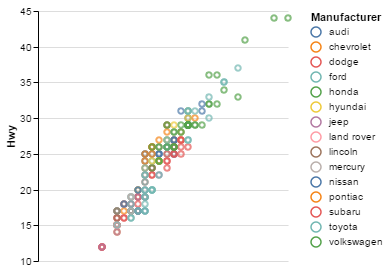

VegaLite.jl enables the generation of Vega-Lite plots from Julia.

`Vega-Lite` (http://vega.github.io/vega-lite/) is a visualization grammar describing mappings from data to graphical properties (marks, axes, scales, ..). For rendering it uses pre-defined design rules that keep the visualization specification succinct while still leaving user control.

Vega-Lite supports :
- data transformation, sorting, filtering and grouping,
- aggregation, binning, and simple statistical analysis (mean, std, var, count, ..).
- plots can be faceted, layered and stacked vertically or horizontally.


To install the package run `Pkg.add("VegaLite")`.


## Principles

The package is mostly a layer translating Julia statements to the Vega-Lite visualization specification format.

Vega-Lite uses the JSON format for its specification. Typical Vega-Lite specs look like :

```JSON
{
  "encoding": {
    "x": {
      "bin": {
        "maxbins": 10
      },
      "field": "IMDB_Rating",
      "type": "quantitative"
    },
    "size": {
      "aggregate": "count",
      "type": "quantitative"
    },
    "y": {
      "bin": {
        "maxbins": 10
      },
      "field": "Rotten_Tomatoes_Rating",
      "type": "quantitative"
    }
  },
  "data": {
    "url": "https://raw.githubusercontent.com/vega/new-editor/master/data/movies.json"
  },
  "mark": {
    "type": "circle"
  }
}
```

This visualization specification can be generated from within Julia by:

```julia
data(url="https://raw.githubusercontent.com/vega/new-editor/master/data/movies.json") |>
  markcircle() |>
  encoding(xquantitative(vlbin(maxbins=10), field=:IMDB_Rating),
           yquantitative(vlbin(maxbins=10), field=:Rotten_Tomatoes_Rating),
           sizequantitative(aggregate=:count))
```

Finally the plot generated by the vega-lite library will look like :


